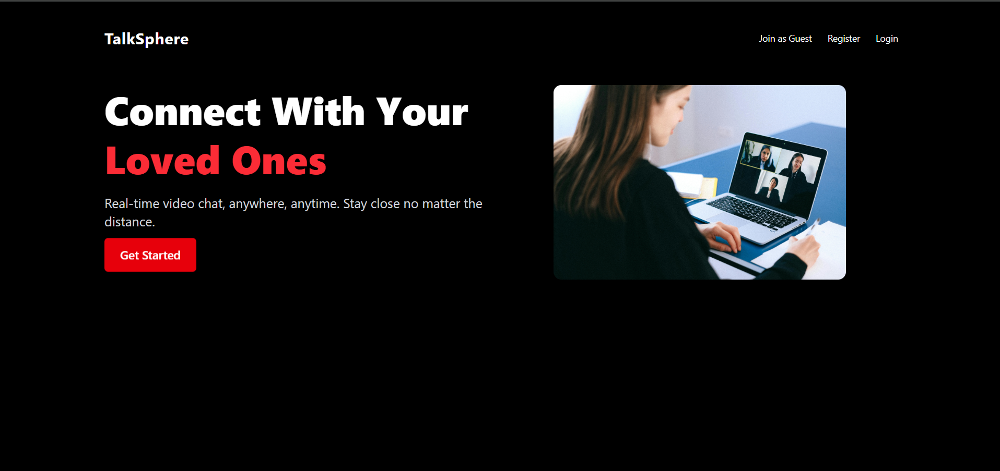
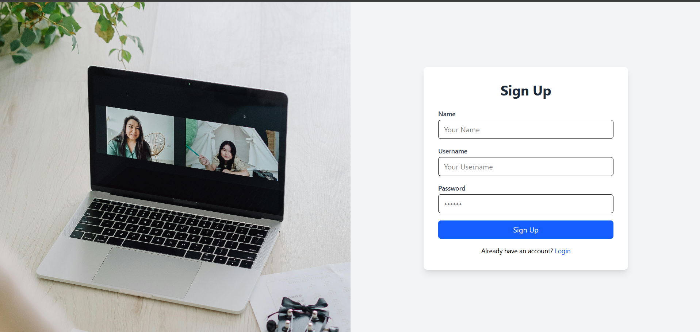
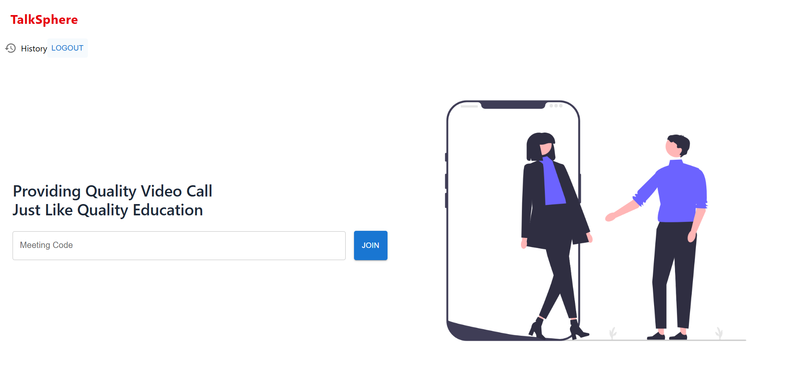
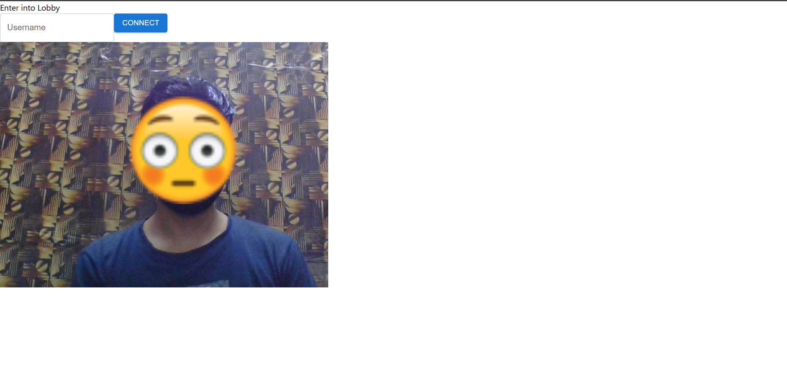
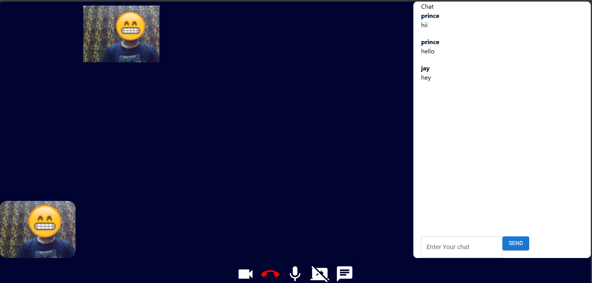
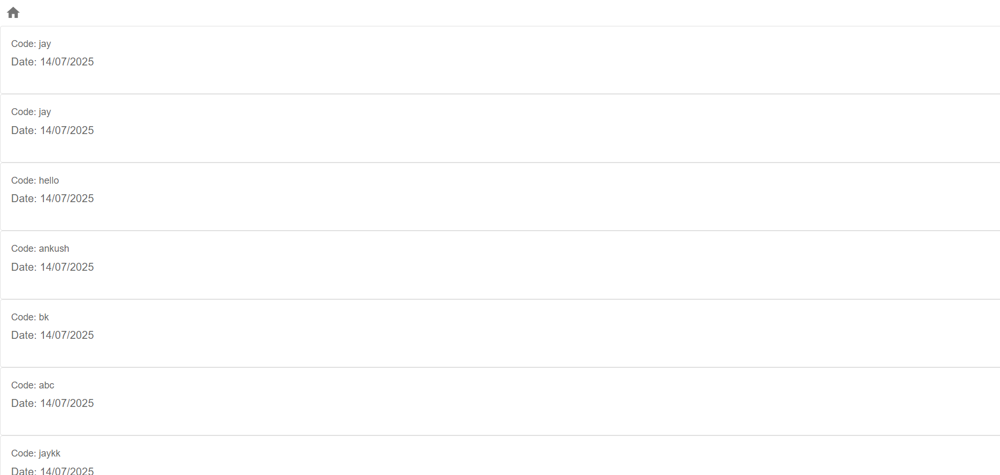

# 📞 Video Conference Web App

A full-stack **MERN** (MongoDB, Express, React, Node.js) based **real-time video conferencing web app** using **Socket.IO** and **WebRTC**. It supports **multi-user calls**, **live chat**, **screen sharing**, and works even across different networks using **Xirsys STUN/TURN servers**.

> 🔴 **Live Site**: [https://video-conference-beige.vercel.app/](https://video-conference-beige.vercel.app/)  
> 🖥️ **Backend**: Deployed separately (handles login, history, ICE credentials)

---

## ✨ Features

- 🔐 Join with just a username (no sign-up required)
- 🎥 Real-time multi-user video/audio calling via WebRTC
- 💬 **Live in-call chat** using Socket.IO
- 🖥️ Screen sharing toggle for presentations
- 🔇 Mute/unmute mic and camera anytime
- 🚪 Leave/End call cleanly
- 📜 **Call History Page** – View your activity `/history`

---

### 🔑 Home Page  

### 🔑 Auth Page  

### 🔑 Logged In Page  

### 🔑 Enter Lobby 

### 📹 In-Call Video UI and Chat Panel  

### 📚 Call History  

---

## ⚙️ Tech Stack

### Frontend
- ✅ React + Vite
- ✅ Tailwind CSS + MUI
- ✅ WebRTC (video/audio)
- ✅ Socket.IO (real-time chat & signaling)

### Backend
- ✅ Node.js + Express
- ✅ MongoDB (to store call history)
- ✅ Xirsys API for TURN/STUN ICE servers

---

